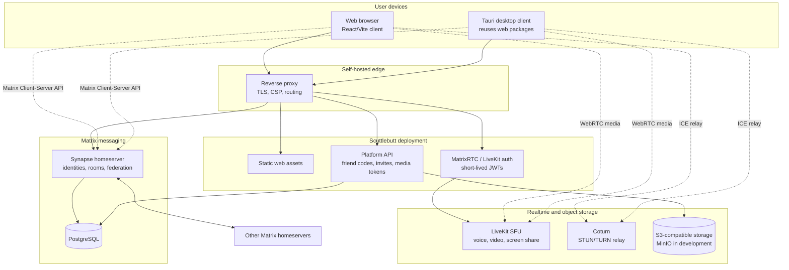
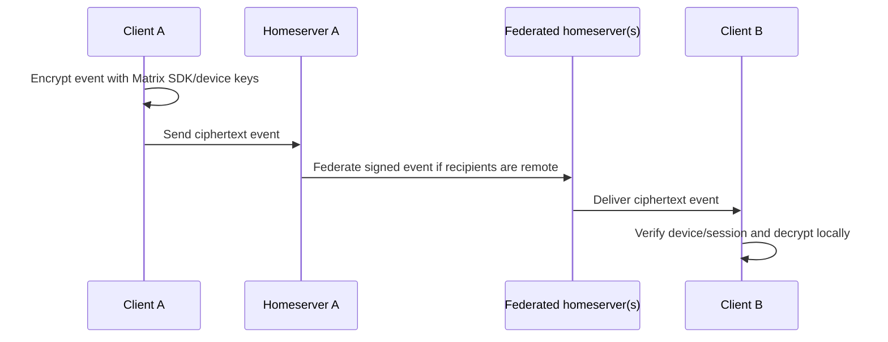
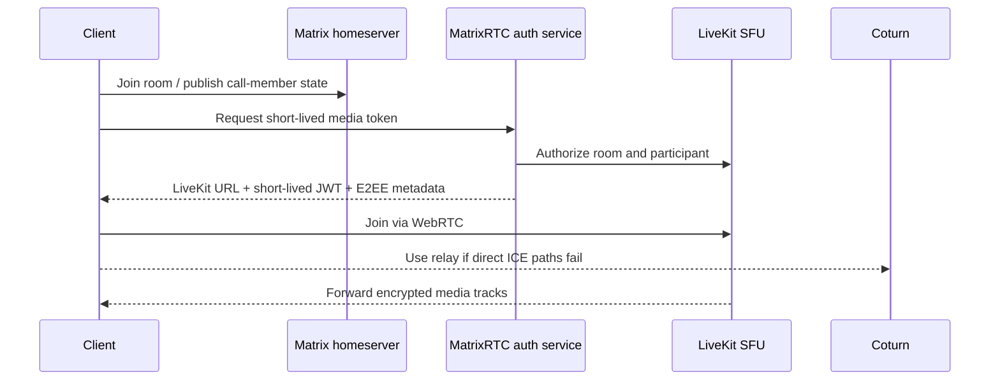

# Scuttlebutt system overview

Status: Phase 0 architecture baseline. This document describes the intended boundaries; it is not a production deployment guide.

## Goals

- Federated messaging through Matrix homeservers.
- E2EE for message content and encrypted attachments where Matrix supports it.
- Self-hosted voice/video/screen sharing through LiveKit and Coturn.
- A usable web client first, with a Tauri desktop client reusing the web frontend later.
- A small platform API only for product features that do not belong in Matrix.
- A deployment path from a local Compose environment to independently operated production components.

## Non-goals for the first implementation

- No custom federation protocol.
- No custom cryptography.
- No global Scuttlebutt account directory.
- No server-side plaintext indexing of encrypted messages.
- No guaranteed 4K60 streaming.
- No mobile application in the initial milestones.
- No subscription gates in the application feature model.

## Proposed monorepo

```text
scuttlebutt/
├── apps/
│   ├── web/                         # React + TypeScript + Vite client
│   ├── platform-api/                # Small Node.js/TypeScript product API
│   ├── desktop/                     # Tauri shell, added after web stability
│   └── docs/                        # Project documentation site, later
├── packages/
│   ├── ui/                          # Accessible shared components
│   ├── config/                      # Shared typed config and environment schema
│   ├── shared-types/                # API and event contracts
│   ├── friend-codes/                # Pure generation/normalization contracts
│   ├── matrix-client/               # Matrix SDK boundary and adapters
│   ├── livekit-client/              # LiveKit/MatrixRTC boundary
│   ├── crypto-boundaries/            # Key-storage and E2EE policy interfaces
│   └── testing/                     # Test fixtures and safe fake services
├── infrastructure/
│   ├── compose/                     # Local development stack
│   ├── matrix/                      # Synapse config templates
│   ├── livekit/                     # LiveKit config templates
│   ├── coturn/                      # TURN config templates
│   └── reverse-proxy/               # Caddy/Traefik examples
├── docs/
│   ├── architecture/
│   ├── decisions/
│   ├── deployment/
│   ├── development/
│   ├── research/
│   └── security/
├── scripts/
├── .github/
├── package.json
├── pnpm-workspace.yaml
└── turbo.json
```

## Runtime topology



## Trust boundaries

1. **Client boundary:** decrypted message content and private cryptographic keys live on the user's device. Compromised browser JavaScript is a release-blocking confidentiality risk.
2. **Homeserver boundary:** Synapse stores encrypted events and unavoidable metadata; it can authenticate, route, federate, retain, and deny service, but should not receive message plaintext for E2EE rooms.
3. **Platform API boundary:** Scuttlebutt's API handles non-Matrix product metadata such as friend-code mappings, invitations, feature policy, and LiveKit token issuance. It must not become a plaintext message proxy.
4. **Media boundary:** LiveKit forwards encrypted media. Transport encryption is not automatically media E2EE; the client must explicitly enable and verify LiveKit E2EE.
5. **Storage boundary:** Encrypted-room attachments are encrypted client-side before object storage. Public/un-encrypted media follows server policy and must be labeled accordingly.
6. **Federation boundary:** Other homeservers are independent operators. Cross-server data and availability are not fully controllable by Scuttlebutt.

## Data ownership and placement

| Data                                          | Primary system                                    | Confidentiality expectation                                            |
| --------------------------------------------- | ------------------------------------------------- | ---------------------------------------------------------------------- |
| Matrix user identity, device/session metadata | Synapse                                           | Server-visible metadata; protect with TLS and access controls.         |
| Encrypted message events                      | Synapse/PostgreSQL                                | Ciphertext at rest; clients hold keys.                                 |
| Friend-code mapping                           | Platform API/PostgreSQL or homeserver-owned store | Pseudonymous, rate-limited, revocable; avoid public enumeration.       |
| LiveKit room token                            | Platform API / MatrixRTC auth                     | Short-lived bearer credential; never log.                              |
| Voice/video/screen media                      | LiveKit + TURN                                    | WebRTC transport encryption plus explicit LiveKit E2EE where enabled.  |
| Encrypted attachments                         | S3-compatible storage                             | Client-encrypted before upload; object key is not a decryption key.    |
| Logs and metrics                              | Operator-controlled observability                 | No message plaintext, encryption keys, access tokens, or media tokens. |

## Deployment profiles

### Development

One Compose project may include the web client, platform API, Synapse, PostgreSQL, LiveKit, Coturn, MinIO, reverse proxy, and a mail catcher. Development secrets may be generated locally and must never be reused in public deployments.

### Production

Components may be split across hosts or clusters. PostgreSQL and S3 should be backed up independently; LiveKit and Coturn require public networking and bandwidth planning; Synapse federation requires stable server names, TLS, reverse-proxy correctness, and time synchronization. Production configuration must use external secrets and a documented restore test.

## Key sequence: encrypted direct message



## Key sequence: room call



## Architecture constraints

- Use the Matrix JS/TypeScript SDK and maintained Rust/WASM crypto implementation; do not write cryptographic primitives.
- Keep platform API authorization separate from Matrix room authorization. The client must never be trusted to assert moderator/admin permissions.
- Make actual media properties observable to the user: resolution, FPS, codec, bitrate, latency, and packet loss.
- Treat Matrix rooms/spaces as the primitive mapping behind Scuttlebutt communities, and document any feature that cannot map cleanly.
- Prefer stable, boring interfaces over a large custom backend.
